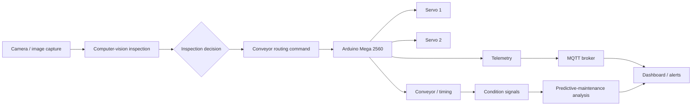

# Development of an Intelligent System for Inspection and Sorting Using Computer Vision and Predictive Maintenance

**Engineering showcase for a graduation project by Deiaa Ahmed Abdo Lootf**

[](https://github.com/DhiaAlhemdani/Advanced-AI-Driven-Industrial-Inspection-and-Sorting-System/actions/workflows/ci.yml)
[](LICENSE)

This repository is being curated as an evidence-first engineering showcase for a bottle inspection and sorting system. It is organized around the complete product boundary: dataset provenance, computer-vision inference, embedded actuation, MQTT/Dashboard monitoring, predictive-maintenance signals, validation evidence, and known limitations.

> **Evidence boundary.** The public Kaggle dataset and the original integration notebook have now been located and audited. The notebook is referenced under [`notebooks/`](notebooks/), and small YAML snapshots are preserved under [`kaggle/`](kaggle/). The thesis PDF, raw benchmark CSVs/logs, exact notebook export, Arduino board firmware, model weights, and media are still pending. The repository therefore does **not** publish a single authoritative accuracy value, reconstructed Arduino firmware, or a claim that the physical system was tested from this checkout.

## Project at a glance

| Area | Current project record |
| --- | --- |
| Inspection task | Computer-vision inspection of bottle components |
| Dataset | [Industrial Inspection System on Kaggle](https://www.kaggle.com/datasets/dhiaalhemdani/industrial-inspection-system) |
| Dataset size | 119 images: 95 training / 24 validation |
| Component classes | `bottle`, `cap`, `label`, `liquid` |
| Physical system | Arduino Mega 2560 conveyor controller with dual servos |
| Observability | MQTT telemetry and dashboard monitoring |
| Project contribution | Computer vision and system integration, as declared by the project owner |
| Validation policy | Detection performance and physical sorting accuracy are reported separately |

The dataset facts above are the project facts currently supplied for this repository. Run the included dataset-report utility against the downloaded Kaggle export to regenerate a machine-readable manifest before adding benchmark claims.

## Engineering profile

This project is presented as an R&D/product-development case study for robotics and autonomous-systems roles. It demonstrates system decomposition across perception, embedded actuation, communications, observability, and maintenance—not just a model notebook. The owner-declared contribution is **computer vision and system integration**; hardware and supporting implementation responsibilities should be attributed from the original project record when those files are added.

## System boundary



The diagram is an architectural view, not a wiring diagram or a claim about the exact original topic names, GPIO pins, model, thresholds, or controller protocol. Those details belong to the original implementation and thesis evidence.

## What is in this repository

- **`docs/`** — architecture, reproducibility, hardware integration contract, validation protocol, limitations, and source-provenance rules.
- **`src/industrial_inspection/`** — small, dependency-light utilities for dataset inventory and metric calculations. These are curation/reproducibility utilities, not a reconstruction of the original hardware implementation.
- **`src/vision/`, `src/control/`, `src/monitoring/`** — clearly separated homes for the original CV, embedded-integration, and monitoring files when they are supplied.
- **`firmware/`, `dashboard/`, `models/`, `data/`, `results/`** — artifact boundaries with instructions and evidence templates; no secrets, raw datasets, or invented firmware are committed.
- **`.github/workflows/ci.yml`** — checks the reproducibility utilities only; it does not simulate or certify physical hardware.

## Reproduce the dataset inventory

The raw Kaggle data is intentionally not committed to Git. Download it from the canonical dataset page and unpack it locally, for example into `data/raw/industrial-inspection-system/`.

```bash
python -m venv .venv
source .venv/bin/activate                 # Windows: .venv\\Scripts\\activate
python -m pip install --upgrade pip
python -m pip install -e ".[dev]"

python -m industrial_inspection.dataset_report \
  data/raw/industrial-inspection-system \
  --class-names bottle cap label liquid \
  --output artifacts/dataset_report.json

pytest -q
```

The report counts image files by split and, when YOLO-style label files are present, counts annotated component instances. It never turns those counts into model accuracy. See [`docs/reproducibility.md`](docs/reproducibility.md).

## Validation without misleading metrics

Three measurements must remain separate:

1. **Detection performance** — model-vs-annotation metrics on a declared split, with model version, confidence, IoU, and class handling recorded.
2. **Physical sorting accuracy** — correct routing decisions divided by physically inspected items, taken from a trial log with the route/bin definition stated.
3. **End-to-end yield or availability** — a system-level measure that also records missed detections, jams, latency, communication loss, and maintenance events.

The repository includes CSV templates for these evidence types under [`results/templates/`](results/templates/). Until the thesis and benchmark logs are available, the result tables intentionally contain no invented values.

## Project map

```text
.
├── README.md
├── data/                         # local-only dataset instructions
├── docs/
│   ├── architecture.md
│   ├── hardware.md
│   ├── limitations.md
│   ├── reproducibility.md
│   ├── source-integrity.md
│   └── validation.md
├── firmware/                     # original firmware boundary; no reconstructed code
├── models/                       # model provenance and export instructions
├── results/                      # evidence policy and blank result templates
├── src/
│   ├── control/                  # original integration/control files when supplied
│   ├── industrial_inspection/    # reproducibility utilities
│   ├── monitoring/               # original MQTT/dashboard files when supplied
│   └── vision/                   # original CV files when supplied
├── tests/
└── pyproject.toml
```

## Limitations and next evidence drop

The current public evidence supports the dataset description and system-level architecture only. To make the repository a complete reproducible implementation, add the original source files and cite them in [`docs/source-integrity.md`](docs/source-integrity.md), then add the thesis and raw benchmark logs. The required fields and acceptance checks are documented in [`docs/validation.md`](docs/validation.md).

For the full engineering narrative, start with [`docs/architecture.md`](docs/architecture.md) and [`docs/reproducibility.md`](docs/reproducibility.md).
