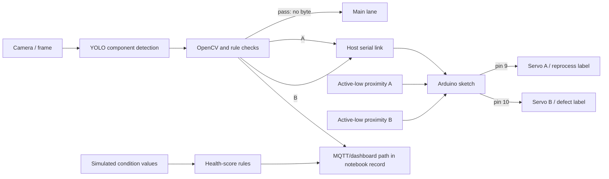

# Intelligent Industrial Inspection and Sorting System

**Graduation-project engineering record by Deiaa Ahmed Abdo Lootf**

[](https://github.com/DhiaAlhemdani/Advanced-AI-Driven-Industrial-Inspection-and-Sorting-System/actions/workflows/ci.yml)
[](LICENSE)

This repository documents a bottle inspection prototype combining object detection, rule-based/OpenCV checks, serially commanded Arduino actuation, a three-route conveyor concept, dashboard monitoring, and simulated predictive-maintenance telemetry.

> **Evidence boundary:** the thesis, Arduino sketch, benchmark CSV/plots, photographs, screenshots, and demo video are now present and inventoried. Training images, labels, annotations, the original notebook, and model weights remain canonical on [Kaggle](https://www.kaggle.com/datasets/dhiaalhemdani/industrial-inspection-system) and are intentionally not duplicated here. The uploaded sources disagree on several numerical and firmware details; this README reports the disagreement rather than silently selecting a headline value. The historical thesis remains unchanged, while an [annotated evidence-reconciled revision](docs/Project%20Research%20-%20Evidence-Reconciled%20Revision.pdf) visibly marks superseded claims and appends the controlling corrections.

## Project record

| Area | Available evidence |
| --- | --- |
| Dataset | 119 images: 95 train / 24 validation; classes `bottle`, `cap`, `label`, `liquid` (Kaggle version-10 record) |
| Thesis | [Original historical PDF](docs/Project%20Research.pdf) plus [annotated evidence-reconciled revision](docs/Project%20Research%20-%20Evidence-Reconciled%20Revision.pdf) and [revision notes](docs/thesis-revision-notes.md) |
| Detection bundle | 121-row Ultralytics `results.csv`, settings, curves, confusion matrices, and qualitative train/validation mosaics |
| Physical evaluation | Thesis describes 245 bottles across five scenarios; no item-level route log is present |
| Firmware | Owner-uploaded [`firmware/sketch_may1a.ino`](firmware/sketch_may1a.ino), preserved as supplied and documented separately |
| Media | One prototype photo, two dashboard/conveyor screenshots, banner, and demo video |
| External-only artifacts | Training data, labels, polygon/LabelMe annotations, original notebook, and model weights on Kaggle |

See the complete [artifact inventory](docs/artifact-inventory.md) for sizes, hashes, and inspection notes.

## Project media

The media below is qualitative project evidence, not a substitute for synchronized trial logs or evaluator output.

### Project banner


### Conveyor prototype


### Dashboard and conveyor demonstration

| Dashboard inspection view | Dashboard accumulated-results view |
| --- | --- |
| [](media/Screenshot_20260725_202954_MX%20Player.jpg) | [](media/Screenshot_20260725_203316_MX%20Player.jpg) |

### Demonstration video

<video src="media/lv_0_٢٠٢٦٠٧٠٥٠٠٢٦٤.mp4" controls width="100%">
  <a href="media/lv_0_٢٠٢٦٠٧٠٥٠٠٢٦٤.mp4">Open or download the project demonstration video</a>.
</video>

If the repository viewer does not render embedded MP4 video, use the [direct video link](media/lv_0_٢٠٢٦٠٧٠٥٠٠٢٦٤.mp4).

## Results at a glance

### Detection metrics (annotation evaluation)

| Evidence source | Precision | Recall | mAP@0.50 | mAP@0.50:0.95 |
| --- | ---: | ---: | ---: | ---: |
| Uploaded CSV, final epoch 121 | 97.367% | 98.584% | 99.414% | 94.317% |
| Uploaded CSV, best mAP@0.50:0.95 row (epoch 117) | 95.780% | 98.816% | 99.389% | 94.441% |
| Kaggle Quick Inference, 24 images / 83 instances | 98.1% | 95.7% | 96.47% | 92.12% |

The Kaggle README headline is consistent with rounded values selected from different CSV epochs (including peak recall 100%), while Quick Inference is a separate, lower-mAP validation run. The thesis's **85–95% inspection accuracy** is an integrated runtime range without a published denominator or standard detector definition. None of these values is physical sorting accuracy.

### Physical sorting claims (route outcomes)

Thesis Table 6:5 and the Kaggle README list 230 routed units out of 245. That arithmetic is **93.88%**, not the table's 95.00%. The fluid row lists 20/35, which is **57.14%**, not 62.00%. Elsewhere the thesis calls physical sorting “flawless” and claims 100%, conflicting with its own table. Without the item-level ledger, this repository does not certify a sorting-accuracy value.

| Measurement type | What it answers | Evidence required |
| --- | --- | --- |
| Detection precision/recall/mAP | Did predicted boxes match annotations? | Weights, split, evaluator/config, annotations |
| Runtime inspection/classification | Did the full vision/rule pipeline assign the intended condition? | Per-item ground truth and decision log |
| Physical sorting accuracy | Did each physical item arrive in the intended lane? | Dated item-level route ledger and hardware revision |
| End-to-end latency | How long from item entry to completed routing? | Synchronized capture, command, sensor, and actuator timestamps |

The full source-by-source reconciliation is in [`results/kaggle-benchmark-snapshot.md`](results/kaggle-benchmark-snapshot.md).

## Benchmark gallery

These are the uploaded Ultralytics artifacts. Curves and confusion matrices describe **box detection** on the recorded validation run; they do not measure physical sorting.

### Training history

[](kaggle/benchmarks/results.png)

### Detection curves

| Precision–recall | F1–confidence |
| --- | --- |
| [](kaggle/benchmarks/BoxPR_curve.png) | [](kaggle/benchmarks/BoxF1_curve.png) |
| **Precision–confidence** | **Recall–confidence** |
| [](kaggle/benchmarks/BoxP_curve.png) | [](kaggle/benchmarks/BoxR_curve.png) |

### Detector confusion matrices

| Counts | Normalized |
| --- | --- |
| [](kaggle/benchmarks/confusion_matrix.png) | [](kaggle/benchmarks/confusion_matrix_normalized.png) |

### Label distribution and training batches

[](kaggle/benchmarks/labels.jpg)

| Training batch 0 | Training batch 1 | Training batch 2 |
| --- | --- | --- |
| [](kaggle/benchmarks/train_batch0.jpg) | [](kaggle/benchmarks/train_batch1.jpg) | [](kaggle/benchmarks/train_batch2.jpg) |

### Validation labels and predictions

| Batch | Ground-truth labels | Model predictions |
| ---: | --- | --- |
| 0 | [](kaggle/benchmarks/val_batch0_labels.jpg) | [](kaggle/benchmarks/val_batch0_pred.jpg) |
| 1 | [](kaggle/benchmarks/val_batch1_labels.jpg) | [](kaggle/benchmarks/val_batch1_pred.jpg) |
| 2 | [](kaggle/benchmarks/val_batch2_labels.jpg) | [](kaggle/benchmarks/val_batch2_pred.jpg) |

## Architecture



The diagram separates the uploaded sketch's observable interface from broader thesis/notebook claims. It is not a wiring diagram. In particular, the sketch uses polling, 9600 baud, 500 ms hold time, and commands `A`/`B`; it does not contain the thesis-described interrupt routine, 115200-baud setting, 20/50 cm flight timers, conveyor emergency-stop command, or acknowledgements. See [`docs/architecture.md`](docs/architecture.md) and [`docs/hardware.md`](docs/hardware.md).

## Repository map

```text
├── docs/                         thesis, inventory, architecture, hardware, validation
├── firmware/                     uploaded Arduino sketch and observed contract
├── kaggle/benchmarks/            uploaded CSV/configuration/plots and image mosaics
├── media/                        project photo, screenshots, banner, and demo video
├── results/                      cross-source reconciliation and evidence templates
├── src/industrial_inspection/    curated inventory/metric/benchmark utilities
├── scripts/                      Kaggle staging and benchmark-summary tools
├── tests/                        tests for curated Python utilities
├── data/, models/, notebooks/    external-artifact instructions; no data or weights
└── src/{vision,control,monitoring}/ implementation boundaries
```

## Reproduce the repository checks

```bash
python -m venv .venv
source .venv/bin/activate                 # Windows: .venv\\Scripts\\activate
python -m pip install --upgrade pip
python -m pip install -e ".[dev]"
pytest -q
python scripts/summarize_benchmark.py kaggle/benchmarks/results.csv
```

To inventory a local Kaggle download without committing it:

```bash
python -m industrial_inspection.dataset_report \
  data/raw/industrial-inspection-system \
  --class-names bottle cap label liquid \
  --output artifacts/dataset_report.json
```

These commands test curation utilities and summarize an existing CSV. They do not rerun model inference or certify hardware.

Rebuild the annotated thesis copy from the checksum-verified original with:

```bash
python -m pip install -e ".[pdf]"
python scripts/build_revised_thesis.py
```

## Documentation

- [Original thesis](docs/Project%20Research.pdf) and [evidence-reconciled revision](docs/Project%20Research%20-%20Evidence-Reconciled%20Revision.pdf)
- [Thesis revision notes and provenance](docs/thesis-revision-notes.md)
- [Artifact inventory](docs/artifact-inventory.md)
- [Architecture and evidence boundaries](docs/architecture.md)
- [Hardware and firmware integration record](docs/hardware.md)
- [Validation protocol](docs/validation.md)
- [Result reconciliation](results/kaggle-benchmark-snapshot.md)
- [Limitations](docs/limitations.md)
- [Reproducibility](docs/reproducibility.md)
- [External artifact policy](docs/artifact-storage.md)

## Current limitations

The validation split is small; model weights and exact notebook/environment are external; model identity differs across sources (`yolov8l-worldv2`, YOLO-World, and YOLOv11m); the physical route table is internally inconsistent; raw timing and item-level trial logs are absent; media is illustrative; and the uploaded firmware does not implement multiple behaviors attributed to firmware in the thesis. Predictive-maintenance values were generated through virtual sensing and are not field-failure prediction metrics.
