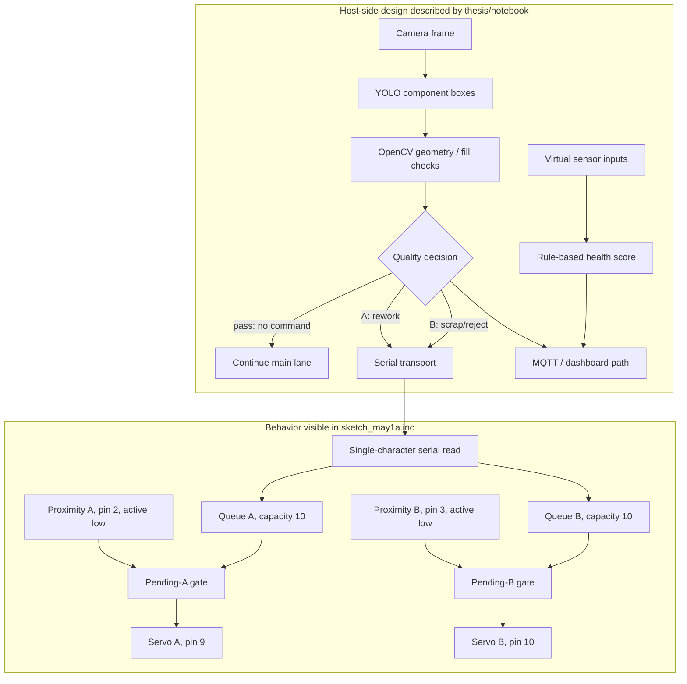

# System architecture and evidence map

## Scope

The project combines component detection, geometric quality rules, serial actuation, physical routing, monitoring, and a simulated condition-health layer. The sources do not describe one fully reproducible build: the thesis, Kaggle notebook record, benchmark bundle, and uploaded Arduino sketch differ. This document labels what each layer actually establishes.

## Evidence-aware data flow

A line in this diagram means code or prose describes a connection; it does not prove the connection was exercised in the photographed system.

## Layer-by-layer record

| Boundary | Repository evidence | What can be said | What remains unverified |
| --- | --- | --- | --- |
| Dataset | Kaggle YAML and public record | Four classes; reported 95/24 image split | Exact downloaded manifest in this checkout |
| Detector training | `results.csv`, plots, `args.yaml`, settings | Metrics/configuration stored in those artifacts | Weight checksum, exact environment/input, rerun |
| Inspection logic | Thesis and public-notebook audit | YOLO plus OpenCV/rule architecture is described | Exact notebook export and end-to-end replay |
| Host → controller | Thesis/notebook prose plus sketch | `A` and `B` are common command concepts | Exact host baud/config matched to uploaded board build |
| Controller | Uploaded `.ino` | Observable constants and control flow listed below | Board revision, compile target, wiring, flashed binary, trial use |
| Physical sorting | Thesis Table 6:5 and media | A prototype and reported test matrix exist | Item-level route outcomes and arithmetic reconciliation |
| Monitoring | Screenshots and notebook audit | Dashboard concepts/UI are evidenced | Dashboard source, MQTT trace, synchronized trial provenance |
| Maintenance | Thesis and screenshots | Virtual-sensing health formula/state demonstration | Physical sensors, failure labels, predictive model accuracy |

## Uploaded firmware contract — code inspection only

The sketch is preserved without reconstructing missing behavior. Static inspection shows:

- Arduino `Servo` library; serial initialized at **9600 baud**.
- Servo A attaches to **pin 9**, is commented `reprocess`, rests at 35°, activates at 0°.
- Servo B attaches to **pin 10**, is commented `defected`, rests at 0°, activates at 35°.
- Proximity inputs use **pins 2 and 3**, plain `INPUT`, and trigger when read `LOW`.
- `A` and `B` set independent pending states; actuation waits for the corresponding sensor.
- Each route has a ten-character circular queue. Queue-full return values are ignored.
- Active position is held for **500 ms**, then returned to rest and the next queued command is considered.
- Sensor values are printed on the same serial port approximately once per second.
- There is no pass command, framing, acknowledgement, item identifier, checksum, retry, pending timeout, queue-overflow report, emergency-stop command, conveyor output, or MQTT code.
- Despite thesis language about interrupts, this sketch polls `digitalRead()` and defines no ISR.

These are source observations, not claims about electrical behavior, servo calibration under load, or hardware test results.

## Cross-source mismatches that affect integration

| Topic | Thesis / notebook record | Uploaded sketch |
| --- | --- | --- |
| UART speed | Thesis: 115200 bps | `Serial.begin(9600)` |
| Sensor processing | Thesis: INT0 interrupt/ISR | Loop polling on pins 2 and 3 |
| Route timing | Thesis: 400 ms and 1000 ms flight delays for 20 cm / 50 cm gates | Waits for route-specific active-low proximity input; no distance timer |
| Sweep / dwell | Thesis: 45–50° sweep, 68 ms, 250 ms dwell | 0↔35° commands, `HOLD_TIME = 500`; physical motion duration unknown |
| Emergency stop | Thesis maintenance section sends `S` | Only `A` and `B` are handled |
| Tracking | Thesis describes indexed targets/registers | Per-route character queues; no item IDs |
| Serial response | Thesis describes command path | No acknowledgement/error response; periodic debug text only |

The host implementation must not be wired to this sketch based only on the thesis settings. Baud rate, electrical mapping, startup positions, route semantics, and safe behavior need bench confirmation first.

## Timing boundaries

The thesis's **20.6 ms** value is a sum of host computational stages. Its **2–4 s** value spans item entry through completed physical deflection. Neither is derivable from this sketch. The sketch's 500 ms hold is only a programmed dwell after a sensor-gated command and is not end-to-end latency.

## Operational failure questions

Before deployment, define and test:

1. What happens when a command is pending but its sensor never goes low?
2. What happens to the eleventh command for a busy route?
3. Can periodic debug text interfere with a host expecting acknowledgements?
4. What state is safe after reset, USB loss, servo power loss, or stuck-low sensor?
5. How are a vision decision and the physical bottle matched without an item ID?
6. Can both servos move safely at once, including power and mechanical clearance?

Until those questions have measured answers, this is a documented prototype interface rather than a production control contract.
