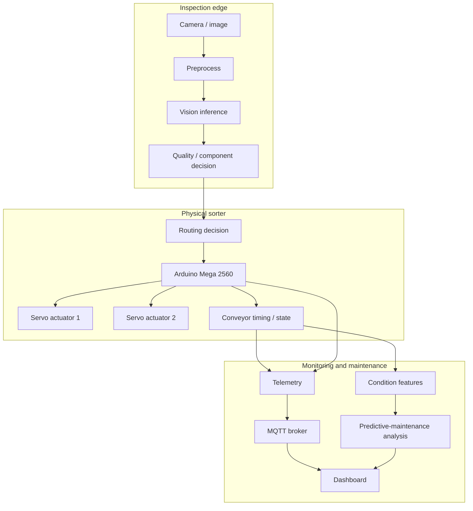

# System architecture

## Purpose

The graduation project combines vision-based bottle/component inspection with physical conveyor sorting and operational monitoring. This document describes the engineering boundary that is currently supported by the project brief. Exact implementation details must be copied from the original source and thesis rather than inferred.

## High-level data flow

## Confirmed system elements

| Boundary | Evidence available now | What still needs the original artifact |
| --- | --- | --- |
| Vision | Computer vision is used for bottle inspection; four reported component classes are `bottle`, `cap`, `label`, `liquid` | Model family, annotations, preprocessing, thresholds, inference code, and runtime target |
| Dataset | 119 images; 95 train and 24 validation are reported; Kaggle URL is public | Download hash, exact directory format, annotation statistics, and dataset version |
| Actuation | Arduino Mega 2560 and two servos are reported | Firmware, pins, servo limits, route map, timing, and safety behavior |
| Monitoring | MQTT and a dashboard are reported | Broker topology, topics, payload schema, dashboard source, and telemetry traces |
| Maintenance | Predictive maintenance is part of the project title/scope | Signals, labels, features, model, alert policy, and time-series evidence |

## Runtime contracts to document when source arrives

### Vision to sorting

- Input image/frame identifier and capture timestamp.
- Class/defect decision and confidence values.
- Coordinate or tracking information used to synchronize the item with the conveyor.
- Timeout behavior when no object is detected or inference exceeds the conveyor timing budget.
- A decision identifier that can be joined to the physical trial log.

### Host to Arduino

- Transport and framing (serial, network bridge, or other mechanism).
- Route command and item/decision identifier.
- Acknowledgement, duplicate handling, timeout, and retry policy.
- Servo actuation limits and return-to-safe-state behavior.

### Controller to monitoring

- Event timestamp and device identifier.
- Conveyor/servo state and fault code.
- Item decision, route command, and completion state.
- Latency and communication status.

These are documentation requirements, not claims that the original implementation used every field.

## Failure-oriented view

| Failure | Detection signal | Required safe response | Evidence to attach |
| --- | --- | --- | --- |
| Unreadable image / low confidence | Vision confidence or capture error | Stop, reject, or route to an explicitly defined unknown path | Inference log and route outcome |
| Lost command or acknowledgement | Controller timeout | Prevent stale actuation; define retry/stop policy | Serial/network trace |
| Servo obstruction or limit fault | Actuator timeout/current/position signal if available | Stop conveyor or enter safe state | Hardware trial record |
| MQTT outage | Broker connection/queue state | Keep local control bounded; buffer or degrade as defined | Outage test log |
| Drift or repeated equipment anomaly | Condition features and maintenance label | Raise a maintenance alert, not an inspection verdict | Time-series and event log |

## Architecture status

This page is intentionally more conservative than a marketing diagram. It captures the system boundary without fabricating GPIO assignments, MQTT topics, model metrics, or hardware-test results. Replace each `needs artifact` item with a link to the original file, thesis section, or dated log as the implementation is added.
